# Kitchen Assistant - Architecture Diagram

## System Architecture

## Data Flow Diagram

```mermaid
sequenceDiagram
    participant U as User
    participant UI as Chat UI
    participant API as Agent API
    participant AC as AgentCore
    participant AG as Agent
    participant B as Bedrock
    participant M as Memory
    participant K as Knowledge Base
    participant F as Fridge Tool
    
    U->>UI: "What can I cook with eggs?"
    UI->>API: POST /invocations
    Note over UI,API: {"prompt": "What can I cook with eggs?"}
    
    API->>AC: invoke(payload)
    AC->>AG: Process with tools
    
    AG->>F: look_into_fridge()
    F-->>AG: Fridge contents
    
    AG->>K: retrieve(recipe query)
    K-->>AG: Recipe suggestions
    
    AG->>M: Check user preferences
    M-->>AG: User preferences
    
    AG->>B: Generate response
    B-->>AG: AI response
    
    AG->>M: Save preferences
    M-->>AG: Confirmation
    
    AG-->>AC: Formatted response
    AC-->>API: {"result": "response"}
    API-->>UI: JSON response
    UI-->>U: "👨‍🍳 Chef: You can make..."
```

## Component Overview

## Key Features Highlight

## Hackathon Highlights

- **AWS Bedrock AgentCore**: Core memory and agent management
- **Strands SDK**: Agent framework and tool integration
- **Real-time Chat**: Terminal-based user interface
- **Memory Persistence**: User preference learning
- **Tool Integration**: Fridge MCP and knowledge retrieval
- **Modern Architecture**: Microservices with clear separation of concerns
